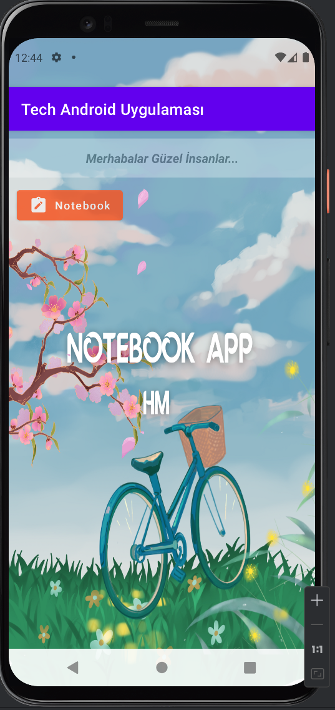
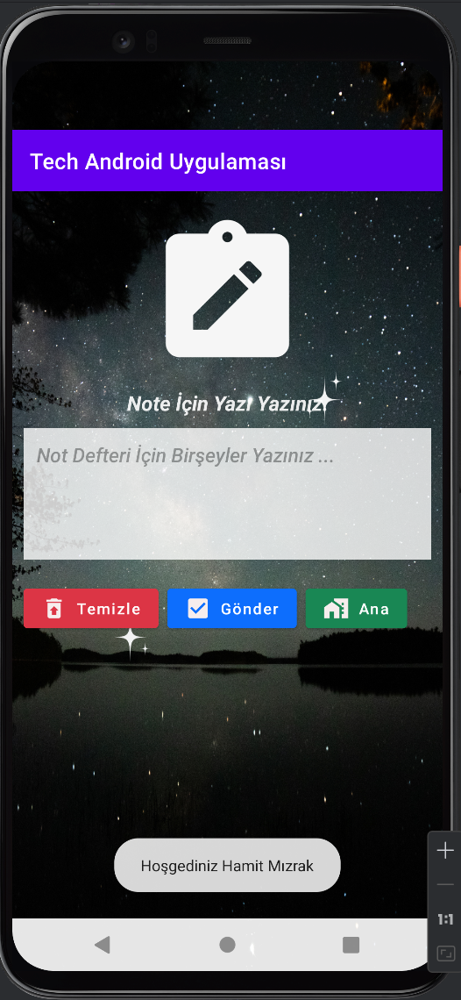

# Android Uygulamasına Hoşgeldiniz
[GitHub](https://github.com/hamitmizrak/Offline_Todolist_Android)
---

[Firebase](https://console.firebase.google.com/project/todolist-44/overview)
---

## ADB  (Aşağıdaki Kodları proje dizinindeki terminalde yazıyorsunuz)
```sh 
adb: Android Debug Bridge
adb kill-server
adb start-server
adb logcat
```
---


## GRADLE (Aşağıdaki Kodları proje dizinindeki terminalde yazıyorsunuz)
```sh 
Build=> Clean Project
Build=> Rebuild Project
File => Invalidate Cache => Hepsini Siliyorsunuz
Uygulamaya Git => Settings => Apps => Tech Android Uygulaması(APK) = Storage&Cache => Clear storage veya clear cache
./gradlew clean    => Cache Temizliği.
./gradlew assembleDebug => Projeyi tekrar çalıştır.
```
---


## Loglama
```sh
verbose<debug<info<warn<error
Log.v("tag","verbose");
Log.d("tag","debug");
Log.i("tag","info");
Log.w("tag","warn");
Log.e("tag","error");
```
---
## Toast
```sh 
   // Toast
   //Toast.makeText(this, "Anasayfaya Hoşgeldiniz", Toast.LENGTH_SHORT).show();
   String welcome=getString(R.string.welcome);
   Toast.makeText(this, welcome, Toast.LENGTH_LONG).show();
```

---
## Live Cycle
```sh 
public class MainActivity extends AppCompatActivity {

    // ONCREATE(1)
    @Override
    protected void onCreate(Bundle savedInstanceState) {
        super.onCreate(savedInstanceState);
        EdgeToEdge.enable(this);
        setContentView(R.layout.activity_main);
        ViewCompat.setOnApplyWindowInsetsListener(findViewById(R.id.main), (v, insets) -> {
            Insets systemBars = insets.getInsets(WindowInsetsCompat.Type.systemBars());
            v.setPadding(systemBars.left, systemBars.top, systemBars.right, systemBars.bottom);
            return insets;
        });

        // Loglama
        Log.e("onCreate","1.alan Create(Oluşturuldu)");

        // Toast
        //Toast.makeText(this, "Anasayfaya Hoşgeldiniz", Toast.LENGTH_SHORT).show();
        String welcome=getString(R.string.welcome);
        Toast.makeText(this, welcome, Toast.LENGTH_LONG).show();
    } //end onCreate

    // ONSTART(2)
    @Override
    protected void onStart() {
        super.onStart();
        Log.e("onStart","2.alan Start(başladı)");
    }

    // ONRESUME(3)
    @Override
    protected void onResume() {
        super.onResume();
        Log.e("onResume","3.alan Resume(Devam Ediyor)");
    }

    // ONPAUSE(4)
    @Override
    protected void onPause() {
        super.onPause();
        Log.w("onPause","4.alan Pause(Mola) Verildi");
    }

    // ONSTOP(5)
    @Override
    protected void onStop() {
        super.onStop();
        Log.w("onStop","5.alan Stop(Durduruldu)");
    }

    // ONRESTART(6)
    @Override
    protected void onRestart() {
        super.onRestart();
        Log.w("onRestart","6.alan Restart(Tekrar Başladı)");
    }

    // ONDESTROY(7)
    @Override
    protected void onDestroy() {
        super.onDestroy();
        Log.w("onDestroy","7.alan Destroy(Öldü)");
    }
} //end MainActivity
```


```
---
## Toast
```sh 

```
---
## Toast
```sh 

```
---
## Toast
```sh 

```

---
## Toast
```sh 

```
---
## Toast
```sh 

```